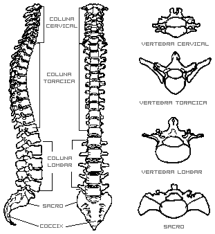

## A coluna é formada pela sobreposição das vértebras desde o atlas até ao cóccix.

Divide-se em quatro porções que, indo de cima para baixo, são: a coluna cervical constituída pelas sete vértebras cervicais; a coluna dorsal ou torácica constituída pelas doze vértebras dorsais; a coluna lombar constituída por cinco vértebras lombares e a coluna sacro-coccígea formada pelo sacro, com cinco vértebras soldadas e pelo cóccix formado por quatro ou cinco vértebras soldadas entre si.

A coluna tem um comprimento médio de cerca de 75 cm.